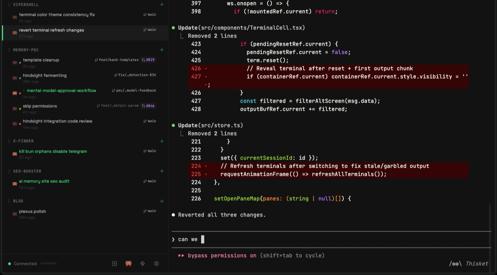

# vipershell

Your machine, anywhere. A full-featured terminal in your browser — no tmux required.



## Quick Start

```bash
npx vipershell
```

Open [http://localhost:4445](http://localhost:4445) in your browser.

That's it. vipershell spawns and manages your shell sessions directly via a
persistent PTY daemon — no tmux, no extra setup.

### Options

```
npx vipershell --port 8080        # custom port
npx vipershell --host 0.0.0.0     # listen on all interfaces (for remote access)
npx vipershell --log-level debug  # verbose logging
```

### Install globally

```bash
npm install -g vipershell
vipershell
```

## Features

- **Terminal in the browser** — full xterm.js terminal with mouse, scroll, and color support
- **Persistent sessions** — PTY daemon keeps your shells alive across server restarts, no tmux needed
- **Pre-warmed shell pool** — new sessions open instantly, no shell-startup lag
- **Workspaces + split panes** — single, horizontal, vertical, three-pane (4 variants), and 2×2 grid layouts
- **Drag & drop everywhere** — reorder workspaces, swap panes within a workspace, move panes between workspaces, or extract a pane into a new workspace
- **Git integration** — branch status, PR links, diff viewer, worktree management
- **File browser** — navigate, edit, and preview files with syntax highlighting
- **Search** — grep across your project from the browser
- **AI session naming** — sessions get auto-named based on terminal activity (requires `claude` or `codex` CLI)
- **Hindsight memory** — optional long-term memory via [Hindsight](https://github.com/vectorize-io/hindsight) so coding agents recall context across sessions
- **Mobile-friendly** — responsive UI with touch scrolling and a tap-only session list
- **File upload** — drop files from your desktop onto any terminal to upload and paste the path
- **Unseen output indicator** — highlight on sessions with new output you haven't seen

## Requirements

- **Node.js** 18+

## License

MIT
